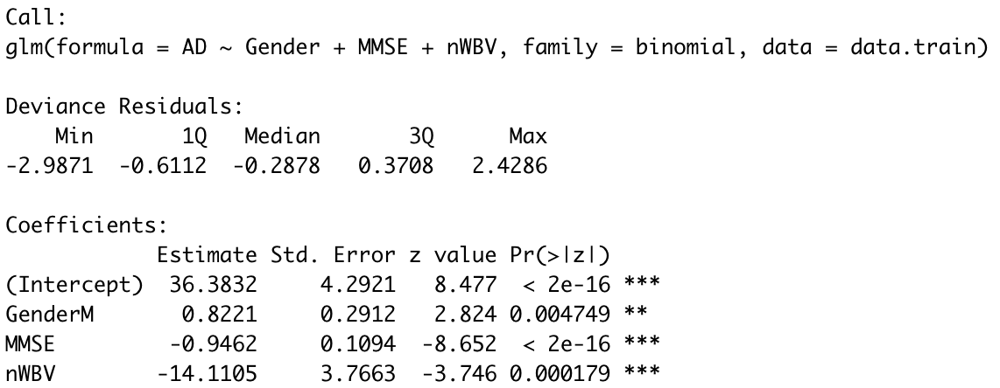

```{r setup, include=FALSE}
knitr::opts_chunk$set(fig.height=4, fig.width=6, warning = F)
if (!require("pacman")) install.packages("pacman")
pacman::p_load(data.table,randomForest, tree, ISLR, rpart, gbm, rpart.plot, caret, car, MASS, rattle, pROC, partykit, ggplot2, glmnet, leaps, dplyr, keras, neuralnet, imager, ranger, elasticnet,factoextra, stargazer, keras, xgboost, randomForestExplainer, DiagrammeR, SHAPforxgboost)
```


# I. Abstract

Alzheimer’s disease (AD) is the most common type of dementia among elderly people that leads to memory loss. More severely, it can affect the patient to carry out daily activities. AD is a progressive disease and usually starts slowly, but changes in the brain can begin many years before the appearance of first symptoms. Age has also shown to be associated with the risk of developing AD.

Our [data](https://www.kaggle.com/datasets/jboysen/mri-and-alzheimers?select=oasis_longitudinal.csv) consists of Magnetic Resonance Imaging information for demented and nondemented elderly adults. In this study, we present several ways of building classifiers to predict whether a subject will be diagnosed to develop dementia.

The data was released by Open Access Series of Imaging Studies (OASIS).

# II. Description of the Data

Two datasets are used in this project. One dataset deals with cross-sectional MRI data for adults aged between 18 to 96. The other dataset deals with longitudinal MRI data for older adults between 60 to 96. The two datasets have the following variables in common: gender, age, Mini Mental State Examination score, estimated total intracranial volume, normalized whole brain volume, etc. After data cleansing, we append the two datasets and obtain 608 valid observations in total.


The dataset is a longitudinal collection of MRI scan history of 150 elder adults aged between 60 and 98. Subjects may be scanned more than once, and there are 373 imaging sessions recorded in total. The following table showcases the features that the original data contains:

|  Variable Name   | Description |
|-------|-------|
| Subject.ID | The unique identification of each subject |
| MRI.ID | The unique identification of each scan session |
| M.F | Gender of the subject |
| Age | Age of the subject |
| Hand | Dominant Hand |
| EDUC | Years of education |
| SES | Socialeconomic status |
| MMSE | Mini Mental State Examination Score |
| eTIV | Estimated total intracranial Volume |
| nWBV | Normalized whole brain volume |
| ASF | Atlas scaling factor |
| MR.Delay | MR Delay Time |
| CDR | Clinical Dementia Rating |

Here are some more detailed explanations of the terms mentioned above:

Mini Mental State Examination (MMSE): This is a 30-point questionnaire which has been widely adopted to measure cognitive functions among elderly people.

Estimated total intracranial volume (eTIV): This is an estimated value of the maximum pre-morbid brain volume.

Atlas scaling factor (ASF): This is a volume-scaling factor that standardizes the head size based on differences in human anatomy.

MR Delay: A delayed MR is performed a few minutes after the injection of the contrast agent. The delayed contrast enhancement might reveal different biological information.

Clinical Dementia Rating: This is a globally accepted measure of the overall severity of dementia. The score has the following 5 values:

0 - Normal

0.5 - Very Mild Dementia

1 - Mild Dementia

2 - Moderate Demantia

3 - Severe Demantia


## Target Value

We will predict whether a patient has developed dementia based on the Clinical Dementia Rating. If a patient has CDR score = 0, the subject has no AD, thus receiving a label 0. If the score > 0, the subject has developed AD, thus will be marked with 1.

# III. Data Cleaning and Preparation

We combine the cross sectional dataset with the longitudinal dataset.

```{r, include = F}
data_cross <- read.csv("data/oasis_cross-sectional.csv")

# all subjects are right-handed. Delay is all empty
data_cross <- data_cross %>% select(-c(Hand, Delay))

# to match the name of data_long
colnames(data_cross)[which(names(data_cross) == "Educ")] <- "EDUC"
head(data_cross)
```


```{r, include = F}
data_long <- read.csv("data/oasis_longitudinal.csv")

# hand only has one unique value. 
# Group has 3 categories: nondemented, demented, converted. Not interested in converted. Will create our own label.
# Visit, MR.Delay information are not contained in data_cross
data_long <- data_long %>% select(-c(Hand,Group,Subject.ID,Visit, MR.Delay))
colnames(data_long)[which(names(data_long) == "MRI.ID")] <- "ID"
head(data_long)
```


```{r, include = F}
# combine data_cross and data_long
data <- rbind(data_cross, data_long)

## check the number of columns which have missing values
names(data)[apply(data, 2, function(x) any(is.na(x)))] # "EDUC" "SES"  "MMSE" "CDR" 
sum(is.na(data$EDUC)) # 201
sum(is.na(data$MMSE)) # 203
sum(is.na(data$SES)) # 239
sum(is.na(data$CDR)) # 201
```

```{r, include = F}

# CDR is the target value. Drop columns where CDR is empty. Fill NA for the other three variables.
data <- data[!is.na(data$CDR),]
# EDUC: 18 different possible values, fill NA with mode
table(data$EDUC)
data[is.na(data$EDUC),"EDUC"] <- 12

# column "SES" refers to social-economic status. It's a categorical variable. fill NA with the mode
table(data$SES)
data[is.na(data$SES),"SES"] <- 2

# column "MMSE" refers to mini-mental state exam score, fill NA with mean
unique(data$MMSE)
mean(na.omit(data$MMSE))
data[is.na(data$MMSE),"MMSE"] <- 27
```


```{r, include = F}
# change gender to factor. recode
colnames(data)[which(names(data) == "M.F")] <- "Gender"
data$Gender <- as.factor(data$Gender)
# data$Gender <- as.factor(ifelse(data$Gender=="F", 0, 1))

# create label
data$AD <- as.factor(ifelse(data$CDR==0, 0, 1))
data <- data %>% select(-CDR)
```

```{r, include = F}
summary(data)
```


# IV.Exploratory Data Analysis

```{r echo = F}
data %>% 
  ggplot(aes(x=Age, fill = Gender)) +
  geom_bar(position='dodge') +
  labs(title = "Demographic Information of Subjects",
       x = "Age",
       y = "Number of Patients") +
  theme_light()
```

## TODO:Change size legend! scale_size_manual doesn't work??


AD is associated with lower mini mental state examination score. 
Age does not pose a significant influence on the examination score and the diagnosis of AD.
Two subjects are having significantly lower mini mental state examination score. They are also visiting the hospital very often.
```{r echo = F}
data %>% 
  ggplot(aes(x=MMSE,y=Age, color = AD, size = 2)) +
  geom_jitter(alpha = 0.8) +
  labs(title = "Mini Mental State Examination Score, Age and AD diagnosis",
       x = "Mini Mental State Examination Score") +
  theme_light()
```


# V. Model Building

## Data Splitting

We split the data into three sets: training, testing and validation. The training set is used to fit a model; the testing set is used to report a model's effectiveness; the validation set is held until the end to evaluate our final model. We randomly select 70% of the data to be the training set, 15% of the observations to be the testing set and the remaining 15% to the the validation set.

```{r, include = F}
# train-validation-test split
N <- length(data$AD)
n1 <- floor(0.7 * N)
n2 <- floor(0.15 * N)

set.seed(10)
idx_train <- sample(N,n1)
idx_no_train <- which(!seq(1:N) %in% idx_train)
idx_test <- sample(idx_no_train, n2)
idx_val <- idx_no_train[which(!(idx_no_train %in% idx_test))]
 
# identification information, i.e. encounter_id and patient_nbr, should not be included in the model
data.train <- data[idx_train,] %>% select(-c(ID))
data.test <- data[idx_test,]  %>% select(-c(ID))
data.val <- data[idx_val,] %>% select(-c(ID))
```


## Model 1: Logistic Classification

### Model Fitting

We first fit a logistic regression model. We select a sparse model by using LASSO regularization technique and use the **cv.glmnet()** function to implement cross validation. The criteria is set to be deviance and 10-fold cross validation is applied. 

The plot below shows how the deviance varies with $\lambda$ and the number of non-zero coefficients.
```{r, echo = F}
X <- model.matrix(AD~., data.train)[,-1]
Y <- data.train[,length(data.train)]

set.seed(10)
fit1.cv <- cv.glmnet(X, Y, alpha=1, family="binomial", nfolds = 10, type.measure = "deviance")
plot(fit1.cv)
```

We start with choosing the set of variables which give the smallest cross-validated error. The 7 variables selected are: Gender, Age, EDUC, SES, MMSE, eTIV and nWBV.

```{r, include = F}
coef.1se <- coef(fit1.cv, s = "lambda.min")
coef.1se <- coef.1se[which(coef.1se != 0),]
vars <- rownames(as.matrix(coef.1se))
vars
```

```{r, include = F}
fit.logit <- glm(AD~Gender+ Age + EDUC + SES + MMSE + eTIV + nWBV, family=binomial, data=data.train)
summary(fit.logit)
```


### Fine Tuning

Fitting the logistic model using these variables, we notice that not all the variables are significant at level 0.05. Thus, based on this model, we proceed to perform backward selection until all the remaining variables are significant at level 0.05.

In the end, only three variables remain, which are Gender, MMSE and nWBV. In fact, we notice that this is the same set of variable corresponding to `lambda.1se`, which is the largest value of $\lambda$ such that the cross-validated error is within 1 standard error of the minimum cross-validated error.

Our final logistic model gives the following result:


```{r, include = F}
fit.logit.final <- glm(AD~Gender+ MMSE + nWBV, family=binomial, data=data.train)
summary(fit.logit.final)
```

### Analysis

Based on the summary table of the model, the logit function is given by:
$$
\begin{split}
logit(P(AD=1 \mid Gender, MMSE, nWBV)) 
&= log(\frac{P(AD=1 \mid Gender, MMSE, nWBV)}{P(AD=0 \mid Gender, MMSE, nWBV)}) \nonumber\\
&= 36.38 + 0.82 \cdot Gender(Male) - 0.95 \cdot MMSE - 14.11 \cdot nWBV
\end{split}
$$

where
$$
\begin{split}
P(AD=1 \mid Gender, MMSE, nWBV) = \frac{exp(36.38 + 0.82 \cdot Gender(Male) - 0.95 \cdot MMSE - 14.11 \cdot nWBV)}{1 + exp(36.38 + 0.82 \cdot Gender(Male) - 0.95 \cdot MMSE - 14.11 \cdot nWBV)}
\end{split}
$$

Here, we will assume that it costs equally to mislabel a subject to be AD as it does to mislabel a non-AD. Thus, we will set the threshold to be 0.5. That is, 

$$
\hat{AD} = 1 \text{ if  } \hat P(AD=1 \mid Gender, MMSE, nWBV) > 0.5
$$


```{r, include = F}
#use test dataset to estimate misclassification error
fit.logit.final.test <- predict(fit.logit.final,data.test,type = "response")
logit.pred <- as.factor(ifelse(fit.logit.final.test > 1/2, 1, 0))
logit.error <- mean(logit.pred != data.test$AD)
round(logit.error,3)
logit.cm <- table(logit.pred, data.test$AD)
logit.cm
```


Using the testing dataset to evaluate the performance of this model, we see that the misclassification error rate is 0.198. The confusion matrix is given below.

|     | $Y=0$ | $Y=1$ |
|-------|-------|-------|
| $\hat{Y}=0$ | 41 | 11 |
| $\hat{Y}=1$ | 7 | 32 |

This model has a sensitivity rate of 0.744 and a specificity rate of 0.854.

```{r, include=F}
logit.recall <- logit.cm[2,2]/sum(logit.cm[,2])
round(logit.recall,3) # sensitivity, recall

specificity <- logit.cm[1,1]/sum(logit.cm[,1])
#round(specificity,3) # specificity


fdr <- logit.cm[2,1] / sum(logit.cm[2,]) # false discovery rate
#fdr

logit.precision <- logit.cm[2,2] / sum(logit.cm[2,]) # positive prediction, precision
round(logit.precision,3)

logit.f1 <- (2*logit.recall*logit.precision)/(logit.recall + logit.precision)
logit.f1
```


### Findings

With very few variables left in the logistic regression model, the result is rather simple to interpret. The model suggests that MMSE, nWBV and age are the top 3 important variables in predicting one's probability of developing AD. The log odds is a decreasing function of MMSE and nWBV. Holding other variables constant, when MSSE decreases, the probability of being diagnosed with AD increases. Similarly, decrease in nWBV also implies higher probability of AD diagnosis. On the other hand, the log odds is an increasing function of age. Specifically, when age is increased by 1, the log odds increases 0.82.


## Model 2 Random Forest 

### Model Fitting and Fine Tuning

The second model that we build is a random forest model. We first set `mtry` (number of randomly chosen predictors at each split) to be 3, which is the square root of the number of predictors. We set `ntree` to be 500. The split criterion is set to be misclassification error.

By plotting the error rate v.s number of trees, we decide to use 300 trees in order to settle down the OOB testing errors.

```{r, echo = F}
set.seed(1)
fit.rf <- randomForest(AD~., data.train, mtry = 3, 
                    ntree = 500)

# Three curves of MCE of 1's, 0's and  overall.
plot(fit.rf)
legend("topright", colnames(fit.rf$err.rate), col=1:3, cex=0.8, fill=1:3)
```
 
Then, by setting `ntree=300`, we want to compare effects of different `mtry`. Thus, we loop `mtry` from 1 to 10 and return the testing OOB errors for each of the model. In the end, we decide to use `mtry=2` which gives the minimum error rate.

```{r, echo = F}
set.seed(3)
rf.error <- 1:10  
for (p in 1:10)  
{
  fit.rf <- randomForest(AD~., data.train, mtry = p, ntree = 300)
  rf.error[p] <- fit.rf$err.rate[250]  # collecting oob error rate based on 250 trees
}
# rf.error   
```

```{r, echo=F}
plot(1:10, rf.error, pch=16,
     main = "Testing errors of mtry with 250 trees",
     xlab="mtry",
     ylab="OOB mse of mtry",
     col = 8,
     lwd = 15)
lines(1:10, rf.error, lwd = 5, col = 8)
points(2, rf.error[2], col = 2, lwd = 13, pch = 19)
```

### Analysis

Using 0.5 as threshold to determine the class of instances in the test dataset, the misclassification rate of our final random forest model is 0.143, the sensitivity rate is 0.814 and the specificity rate is 0.896. The confusion matrix is also shown below and we can see that the model roughly achieves a balance to predict positive and negative class.


|     | $Y=0$ | $Y=1$ |
|-------|-------|-------|
| $\hat{Y}=0$ | 43 | 8 |
| $\hat{Y}=1$ | 5 | 35 |

```{r, include = F}
set.seed(3)
fit.rf.final <- randomForest(AD~., data.train, 
                             mtry = 2, 
                             ntree = 300)
fit.rf.final.prob <- predict(fit.rf.final, data.test, type = 'prob')
fit.rf.final.pred <- as.factor(ifelse(fit.rf.final.prob[,2] > 1/2, 1, 0))
fit.rf.test.err <- mean(data.test$AD != fit.rf.final.pred)
fit.rf.test.err
```


```{r, include = F}
rf.cm  <- table(fit.rf.final.pred, data.test$AD)
rf.cm
```


```{r, include = F}
rf.recall <- rf.cm[2,2]/sum(rf.cm[,2])
round(rf.recall,3)


rf.precision <- rf.cm[2,2] / sum(rf.cm[2,]) # positive prediction, precision
round(rf.precision ,3)

rf.f1 <- (2*rf.recall*rf.precision)/(rf.recall + rf.precision)
rf.f1
```


### Findings

From the variable importance plot of our final random forest model, we can see that MMSE is the most important feature in this model. nWBV and Age also have high importance. This result corresponds with the finding of logistic classification model.

```{r, echo = F}
set.seed(3)
varImpPlot(fit.rf.final)
```

The plot below demonstrates the distribution of minimal depth among all the trees in the forest. The vertical bar is the mean of minimal depth for each feature. This plot can give us a clearer idea of the role that each feature plays in our model. 

We can see that MMSE and nWBV are more likely to be the root of the tree compared to other variables. The average minimal depths of MMSE and nWBV are around 1.5, suggesting that many dementia observations can be separated effectively on the basis of these two variables.

```{r}
# min_depth <- min_depth_distribution(fit.rf.final)
# save(min_depth, file = "RData/min_depth.rda")
load("RData/min_depth.rda")
plot_min_depth_distribution(min_depth)
```

```{r, include = F}
# importance_frame <- measure_importance(fit.rf.final)
# plot_multi_way_importance(importance_frame, size_measure = "p_value")
```


## Model 3 & 4: Boosting

### Model Fitting and Fine Tuning

For boosting, we implement both gradient boosting and extreme gradient boosting model. Both models turn out to produce similar result on the testing dataset.

We use the grid search method which iterates over many possible combinations of hyperparameter values, thus determining the best-performing set of hyperparameters. 

In the case of gradient boosting, the `distribution` is set to be `multinomial`. We then look at 135 models with various combinations of learning rate, tree numbers, tree depth and minimum number of observations in the end node. We apply 10-fold cross validation and record the minimum cross validated error for each of the model. 

```{r, eval = F, include = F}
## DO NOT RUNNNNNNNNN THIS CHUNKKKKK
## Gradient Boosting
# hyper_grid <- expand.grid(shrinkage = c(.0075, .01, .0125, .015, .0175),
#                           n.trees = c(500, 800, 1000),
#                           interaction.depth = c(1, 3, 5),
#                           n.minobsinnode = c(5, 10, 15))
# 
# nrow(hyper_grid)
# 
# for(i in 1:nrow(hyper_grid)) {
#     print (i)
#   
#     set.seed(1)
#     fit.gbm.tune <- gbm(AD~.,distribution = "multinomial",
#                     data = data.train,
#                     n.trees = ntree,
#                     interaction.depth = hyper_grid$interaction.depth[i],
#                     shrinkage = hyper_grid$shrinkage[i],
#                     n.minobsinnode = hyper_grid$n.minobsinnode[i],
#                     cv.folds = 10,
#                     n.cores = NULL,
#                     verbose = FALSE)
#     
#     hyper_grid$min_cv_error[i] <- min(fit.gbm.tune$cv.error)
#   }
# 
# 
# hyper_grid %>%
#     dplyr::arrange(min_cv_error) %>%
#     head(3)

# save(hyper_grid,file='RData/hyper_grid.RData')
```

```{r,include = F}
load('RData/hyper_grid.RData')
```

```{r, include = F}
set.seed(2)
fit.gbm.final <- gbm(AD~ .,
                    distribution = "multinomial",
                    data = data.train,
                    n.trees = 1000,
                    interaction.depth = 5,
                    shrinkage = 0.01,
                    n.minobsinnode = 15,
                    cv.folds = 10,
                    n.cores = NULL, 
                    verbose = FALSE) 
```


In the case of extreme gradient boosting, we apply 10-fold cross validation and set the `early_stopping round` to be 50 to avoid overfitting. This means that the algorithm will be forced to stop if we do not see an improvement of the model's performance in 50 iterations. Similar to the implementation of gradient boosting, we use grid search and test 240 models in total. We tune hyperparameters include learning rate, tree depth, minimum loss reduction for a split and penalty on the number of leaves in a tree, etc.


```{r, include = F}
## extreme gradient boosting

data.train$AD <- as.numeric(as.factor(data.train$AD))-1
data.test$AD <- as.numeric(as.factor(data.test$AD))-1
data.val$AD <- as.numeric(as.factor(data.val$AD))-1

dtrain <- xgb.DMatrix(data = select(data.train, -AD) %>% data.matrix,
                     label = pull(data.train, AD))
dtest <- xgb.DMatrix(data = select(data.test, -AD) %>% data.matrix,
                    label = pull(data.test, AD))
dval <- xgb.DMatrix(data = select(data.val, -AD) %>% data.matrix,
                    label = pull(data.val, AD))

params <- list(booster = 'gbtree',    
              eta = 0.2, 
              max_depth = 3, 
              subsample = 0.7, 
              gamma = 1, 
              colsample_bytree = sqrt(ncol(data.train)-1) / sqrt(ncol(data.train)-1),
              min_child_weight = 1, 
              objective = 'binary:logistic' )

xgb.cv.result <- xgb.cv(data=dtrain, params = params, nrounds = 500,
                       early_stopping_rounds = 50,
                       nfold = 10,
                       prediction = TRUE,
                       verbose = 0)
```


```{r, eval = F, include = F}
## DO NOT RUNNNNNNNNN
# set.seed(1)
# # ntrees = xgb.cv.result$best_iteration
# param_grid = expand.grid(
#   nrounds = 300,
#   eta = seq(2,24,2)/300,
#   subsample = 0.7,
#   colsample_bytree = sqrt(ncol(data.train)-1) / sqrt(ncol(data.train)-1),
#   max_depth = c(1,2,3,4,5),
#   gamma = c(0.3, 0.5, 0.8, 1),
#   min_child_weight = 1
# )
# 
# xgb_control <- trainControl(
#   method="cv",
#   number = 10
# )
# 
# xgb.tuned <- train(AD~., data=data.train, trControl=xgb_control, tuneGrid=param_grid, lambda=0, method="xgbTree" ,objective = 'binary:logistic' )
# 
# save(xgb.tuned,file='RData/xgb.tuned.RData')
```

```{r, include = F}
load('RData/xgb.tuned.RData')
# xgb.tuned$bestTune
```


### Analysis

Both gradient boosting model and extreme gradient boosting model give an error rate of 0.143.

The confusion matrix of gradient boosting model:

|           | $Y=0$ | $Y=1$ |
|-----------|-------|-------|
|$\hat{Y}=0$|  44   |   9   |
|$\hat{Y}=1$|  4    |   34  |

The confusion matrix of extreme gradient boosting model:


|           | $Y=0$ | $Y=1$ |
|-----------|-------|-------|
|$\hat{Y}=0$|  42   |   7   |
|$\hat{Y}=1$|  6    |   36  |

We see that on this specific testing dataset, gradient boosting model has fewer false discovery cases than the extreme gradient boosting model. On the other hand, extreme gradient boosting model has a better balance between false negative and false positive rate. Overall, the performance of the two boosting methods are rather similar.


```{r, include = F}
# gradient boosting result
fit.gbm.prob <- predict(fit.gbm.final, n.trees = fit.gbm.final$n.trees, data.test)
pred.gbm <- as.factor(ifelse(fit.gbm.prob[,2,] >= 0, "1", "0"))
gbm.error <- mean(data.test$AD != pred.gbm )
gbm.error

gb.cm <- table(pred.gbm, data.test$AD)
gb.cm
```


```{r}
gb.recall <- gb.cm[2,2]/sum(gb.cm[,2])
round(gb.recall,3)


gb.precision <- gb.cm[2,2] / sum(gb.cm[2,]) # positive prediction, precision
round(gb.precision ,3)

gb.f1 <- (2*gb.recall*gb.precision)/(gb.recall + gb.precision)
gb.f1
```

```{r, include = F}
# extreme gradient boosting result
colnames(dtest) <- NULL
pred<- predict(xgb.tuned$finalModel, dtest)
xgb.pred <- as.factor(ifelse(pred >= 0.5, "1", "0"))
xgb.error <- mean(data.test$AD != xgb.pred)
xgb.error

xgb.cm <- table(xgb.pred, data.test$AD)
xgb.cm 
```


```{r}
xgb.recall <- xgb.cm[2,2]/sum(xgb.cm[,2])
round(xgb.recall,3)

xgb.precision <- xgb.cm[2,2] / sum(xgb.cm[2,]) # positive prediction, precision
round(xgb.precision ,3)

xgb.f1 <- (2*xgb.recall*xgb.precision)/(xgb.recall + xgb.precision)
xgb.f1
```


### Findings

Below, the table shows the top 5 important features in the Extreme Gradient Boosting model.
```{r, echo = F}
xgb.top5 <- head(xgb.importance(model=xgb.tuned$finalModel),5) %>% select(-Cover)
xgb.top5
```

The `gain` measures the contribution of the feature to the model. We can see that MMSE has a significantly higher `gain` than other variables. The `frequency` measures the relative proportion of times for which a feature occurs in the trees. We see that nWBV and eTIV have high `frequency`. MMSE and Age also have relatively high `frequency`.


We now display the first tree in the Extreme Gradient Boosting model. We see that the first cut is based on MMSE and the second cut is based on nWBV. Age and eTIV appear in subsequent cuts. This roughly corresponds to the feature importance table shown above. 

```{r, echo = F}
xgb.plot.tree(model = xgb.tuned$finalModel, trees = 1)
```


## Model 5: Ensemble Model

We have built four models in total: logistic classification, random forest, gradient boosting and extreme gradient boosting. Taking the majority vote of the result of these four models gives us the fifth model. 

The miclassification error is about 0.143. The confusion matrix is shown below.

|           | $Y=0$ | $Y=1$ |
|-----------|-------|-------|
|$\hat{Y}=0$|  43   |   8   |
|$\hat{Y}=1$|  5    |   35  |


```{r, include = F}
combined.res <- data.frame(cbind(as.character(logit.pred), 
                                 as.character(fit.rf.final.pred), 
                                 as.character(pred.gbm), 
                                 as.character(xgb.pred)))
colnames(combined.res) <- c("logit", "rf", "gbm", "xgb")

combined.res$logit <- as.numeric(combined.res$logit)
combined.res$rf <- as.numeric(combined.res$rf)
combined.res$gbm <- as.numeric(combined.res$gbm)
combined.res$xgb <- as.numeric(combined.res$xgb)

ensemble_func <-  function(a, b, c, d) (a + b + c + d)>=2

combined.res$ensemble <- apply(combined.res, 1, 
                                function(x) 
                                  ensemble_func(x["logit"], x["rf"], x["gbm"], x["xgb"]))

combined.res$ensemble <- as.numeric(combined.res$ensemble)
ensemble.pred <- combined.res$ensemble
ensembled_error <- mean(ensemble.pred != data.test$AD)
ensembled_error 
```

```{r}
ensemble.cm  <- table(ensemble.pred, data.test$AD)
ensemble.cm

ensemble.recall <- ensemble.cm[2,2]/sum(ensemble.cm[,2])
round(ensemble.recall,3)


ensemble.precision <- ensemble.cm[2,2] / sum(ensemble.cm[2,]) # positive prediction, precision
round(ensemble.precision ,3)

ensemble.f1 <- (2*ensemble.recall*ensemble.precision)/(ensemble.recall + ensemble.precision)
ensemble.f1
```


## Final Model & Validation

We now compare the testing error and the F1 score of these five models.

```{r, echo = F}
res.comp <- data.frame(
  Model = c("Logistic Model", "Random Rorest",  "Gradient Boosting Machine", "Extreme Gradient Boosting", "Ensemble Model"),
  `Test Error` = c(logit.error, fit.rf.test.err, gbm.error ,xgb.error, ensembled_error),
  `F1 Score` = c(logit.f1, rf.f1, gb.f1, xgb.f1, ensemble.f1)
  )
res.comp
```

We see that logistic regression has the highest testing error and lowest F1 Score. The other 4 models give the same testing error, but Extreme Gradient Boosting has a slightly higher F1 score. 

We will still choose the ensemble model as our final model, since the ensemble method can help reduce variance and can be more robust. We use the validation dataset to evaluate our final model. The misclassification error rate turns out to be 17.4%. The model has a recall rate of 94.4% and a precision rate of 70.1%. Below, the confusion matrix suggests that the ensemble model has a high false discovery rate, which turns out to be 29.2%.

|           | $Y=0$ | $Y=1$ |
|-----------|-------|-------|
|$\hat{Y}=0$|  42   |   2   |
|$\hat{Y}=1$|  14   |   34  |


```{r}
# logit val
logit.val.prob <- predict(fit.logit.final,data.test,type = "response")
logit.val.pred <- as.factor(ifelse(logit.val.prob > 1/2, 1, 0))

# random forest val
rf.val.prob <- predict(fit.rf.final, data.val, type = 'prob')
rf.val.pred <- as.factor(ifelse(rf.val.prob[,2] > 1/2, 1, 0))

# gbm val
gbm.val.prob <- predict(fit.gbm.final, n.trees = fit.gbm.final$n.trees, data.val)
gbm.val.pred <- as.factor(ifelse(gbm.val.prob[,2,] >= 0, 1, 0))

# xgb val
colnames(dval) <- NULL
pred <- predict(xgb.tuned$finalModel, dval)
xgb.val.prob <- predict(xgb.tuned$finalModel, dval)
xgb.val.pred <- as.factor(ifelse(xgb.val.prob  >= 0.5, 1, 0))

# combine results + ensemble
val.res <- data.frame(cbind(as.character(logit.val.pred),
                            as.character(rf.val.pred), 
                            as.character(gbm.val.pred), 
                            as.character(xgb.val.pred)))

colnames(val.res) <- c("logit", "rf", "gbm", "xgb")


val.res$logit <- as.numeric(val.res$logit)
val.res$rf <- as.numeric(val.res$rf)
val.res$gbm <- as.numeric(val.res$gbm)
val.res$xgb <- as.numeric(val.res$xgb)
val.res$ensemble <- apply(val.res, 1, 
                                function(x) ensemble_func(x["logit"], x["rf"], x["gbm"], x["xgb"]))

val.res$ensemble <- as.numeric(val.res$ensemble)
```


```{r}
# validation result
ensemble.val.pred <- val.res$ensemble
ensembled.val.error <- mean(ensemble.val.pred != data.val$AD)
ensembled.val.error

val.cm  <- table(ensemble.val.pred, data.val$AD)
val.cm

val.recall <- val.cm[2,2]/sum(val.cm[,2])
round(val.recall,3)

val.precision <- val.cm[2,2] / sum(val.cm[2,]) # positive prediction, precision
round(val.precision ,3)

val.f1 <- (2*val.recall*val.precision)/(val.recall + val.precision)
val.f1

fdr <- val.cm[2,1] / sum(val.cm[2,])
fdr
```


# VI. Conclusion


# VII. Reference 

Fulton, L.V.; Dolezel, D.; Harrop, J.; Yan, Y.; Fulton, C.P. Classification of Alzheimer’s Disease with and without Imagery Using Gradient Boosted Machines and ResNet-50. Brain Sci. 2019, 9, 212. https://doi.org/10.3390/brainsci9090212

Knight Alzheimer Disease Research Center, CDR Scoring Table: https://knightadrc.wustl.edu/professionals-clinicians/cdr-dementia-staging-instrument/cdr-scoring-table/

# VIII. Appendix
```{r, include = F, eval = F}

fit.logit.final.roc <- roc(data.train$AD, fit.logit.final$fitted)
# fit.logit.final.roc <- roc(data.test$AD, fitfinal.pred)

plot(1-fit.logit.final.roc$specificities, fit.logit.final.roc$sensitivities, 
     col = "red", lwd = 3, type = "l",
    xlab = "False Positive",
    ylab = "True Positive (Sensitivity)",
    main = "Logistic Regression Model: ROC Curve")

legend("bottomright", c(paste0("AUC = ", round(fit.logit.final.roc$auc,2))),
       col = c("red"))
```
 
```{r, include = F, eval = F}
fit.rf.final.roc <- roc(data.test$AD, fit.rf.final.prob[,2])

plot(1-fit.rf.final.roc$specificities, fit.rf.final.roc$sensitivities, 
     col = "red", lwd = 3, type = "l",
    xlab = "False Positive",
    ylab = "True Positive (Sensitivity)",
    main = "Final Model: ROC Curve")

legend("bottomright", c(paste0("AUC = ", round(fit.rf.final.roc$auc,2))),
       col = c("red"))
```
 
```{r}
fit.gbm.final.roc <- roc(data.test$AD, fit.rf.final.prob[,2])

plot(1-fit.rf.final.roc$specificities, fit.rf.final.roc$sensitivities, 
     col = "red", lwd = 3, type = "l",
    xlab = "False Positive",
    ylab = "True Positive (Sensitivity)",
    main = "Final Model: ROC Curve")

legend("bottomright", c(paste0("AUC = ", round(fit.rf.final.roc$auc,2))),
       col = c("red"))

```
 


 
 

